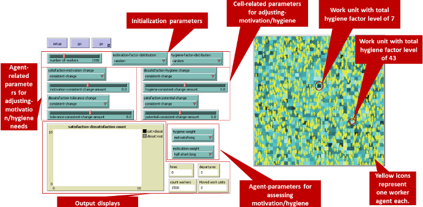
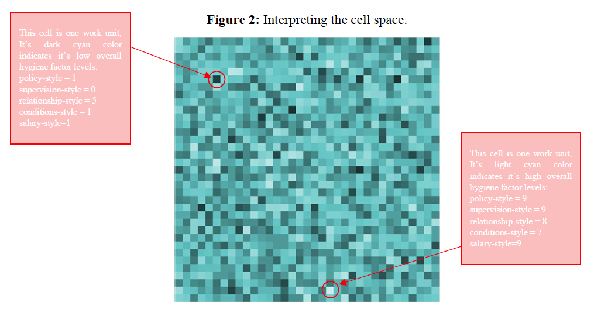

# The Human Resource Management Parameter Experimentation Tool (HMR-PET)

Copy of the code and ODD oringally uploaded to <https://www.comses.net/codebase-release/7029c19d-669f-4f5d-ad68-f06d65c76759/>

## Full Reference

**Iasiello, C., Crooks, A.T. and Wittman, S.** (2020), The Human Resource Management Parameter Experimentation Tool, *2020 International Conference on Social Computing, Behavioral-Cultural Modeling & Prediction and Behavior Representation in Modeling and Simulation*, Washington DC.

## Abstract

"Human resource management (HRM) draws on the field of organizational theory (OT) to identify, quantify, and manage people-based phenomena that impact organizational operations and outcomes. OT research has long used computational methods and agent-based modeling to understand complex adaptive systems. Agent-based modeling methodologies within HRM, however, are still rare. Within the HRM and management science literature, Herzberg’s et al. (1959) Two-Factor Theory (TFT) is a framework that has been tested and used for decades. Its ability to capture the interaction between a work force’s motivation and their environment’s hygiene lends itself well to agent-based modeling as a method of study. Here, we present the development of the Human Resources Management-Parameter Experimentation Tool (HRM-PET) as the first explicit ABM instantiation of TFT, filling the gap between the study of HRM and computational OT tools like agent-based modeling."

**Keywords**: Human Resources Management, Management Science, Workforce Dynamics, Agent-based Modeling.

## Whats Here?

* [The NetLogo Model (NetLogo 6.1.0)](HRM-PET.nlogo)
* [The ODD+D of the Model](HRMPET_ODDandD.pdf)

## Example Figures

**Graphical User Interface of the model:**

**Interpreting the cell space:**

## Example Model Run

